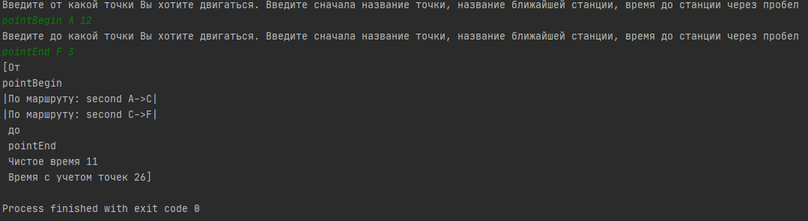

# Проект расчёта оптимального пути

Программа для поиска кратчайшего маршрута между остановками на основе сети автобусных маршрутов с использованием алгоритма Флойда.

## Навыки

## Описание

Проект предназначен для поиска оптимального (кратчайшего) пути между автобусными остановками в городской транспортной сети. Программа учитывает:
* несколько веток автобусных маршрутов;
* пересекающиеся остановки;
* расстояния между соседними остановками.

## Функциональность

Программа позволяет:
1. Загрузить карту автобусных маршрутов (остановки и расстояния между ними в виде текста(map1.txt)).
2. Найти кратчайший путь между любыми двумя остановками.
3. Вывести маршрут с указанием последовательности остановок.
4. Показать общую длину найденного маршрута.

## Принцип работы алгоритма Флойда

Алгоритм Флойда (Флойда‑Уоршелла) находит кратчайшие пути между всеми парами вершин во взвешенном графе.

**Основные шаги:**

1. **Инициализация матрицы расстояний** $D$ размером $n \times n$, где $n$ — количество остановок:
   * $D[i][i] = 0$ (расстояние от остановки до себя);
   * $D[i][j] = w_{ij}$, если есть прямое соединение между остановками $i$ и $j$ (где $w_{ij}$ — расстояние);
   * $D[i][j] = \infty$, если прямого соединения нет.

2. **Основной цикл** (по всем промежуточным остановкам $k$ от $1$ до $n$):
   Для каждой пары остановок $(i, j)$ проверяем, можно ли сократить путь через остановку $k$:
   $$D[i][j] = \min(D[i][j],\ D[i][k] + D[k][j])$$

3. **Восстановление пути** с использованием дополнительной матрицы предшественников $P$, где $P[i][j]$ хранит последнюю промежуточную остановку на пути от $i$ к $j$.

**Сложность алгоритма:** $O(n^3)$, где $n$ — число остановок. Подходит для графов небольшого и среднего размера.

**Преимущества для данной задачи:**
* находит кратчайшие пути между **всеми парами** остановок за один запуск;
* работает с **неориентированными графами** (движение между остановками двустороннее);
* корректно обрабатывает **пересечения маршрутов** (общие остановки);
* позволяет быстро отвечать на множественные запросы о маршрутах.

## Технические детали

* **Язык программирования:** Java.
* **Структура данных:** взвешенный граф (представлен матрицей смежности, которая заполняется из карты).
* **Реализация алгоритма:** классическая реализация алгоритма Флойда‑Уоршелла с восстановлением пути.
